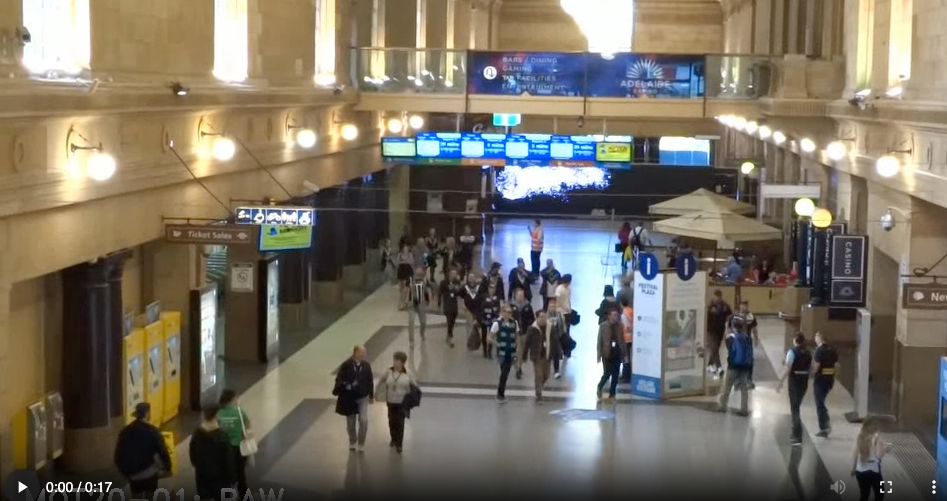

# การบ้าน: นับจำนวนคนและ Tracking ตาม ID บุคคลเฉพาะ

## คำอธิบาย
ในงานนี้ เราต้องการให้คุณพัฒนาวิธีการหรือขั้นตอน (pipeline) สำหรับนับจำนวนคนที่เข้ามาในสถานที่หนึ่ง โดยใช้ข้อมูลหรือวิดีโอจากลิงก์ต่อไปนี้  
- [MOT20-01](https://motchallenge.net/vis/MOT20-01)  

  

**สิ่งที่เพิ่มเติม**  
- ต้องมีการ Assign **ID** ให้กับบุคคลที่ตรวจจับได้ (Object Tracking) โดยสามารถระบบุใด้สูงสุด 3 คน

- ผู้ใช้ต้องสามารถระบุ ID ใดก็ได้ที่ต้องการเฝ้าติดตามเป็นพิเศษ ระบบจะทำการ Segment บุคคล ID นั้นในภาพหรือวิดีโอ และทำการ Track ตำแหน่งหรือการเดินของ ID ดังกล่าว โดยเก็บเส้นทางการเดิน (tracking path) ของ ID นั้น

   เช่นระบุ id = 1:

  

- นับจำนวนคนทั้งหมดที่เข้าและออก ในสถานที่ (ระบุ id พร้อมนับ) 

## วัตถุประสงค์
1. ฝึกการ **Object Detection** และ/หรือ **Segmentation** เพื่อตรวจจับตำแหน่งของคนในวิดีโอ  
2. ฝึกการ **Object Tracking** โดยมีการกำหนด ID ให้แต่ละบุคคลอย่างต่อเนื่องตลอดวิดีโอ  
3. ผู้ใช้สามารถระบุ ID ที่ต้องการติดตามโดยเฉพาะ และระบบจะแสดงผลการ Tracking (รวมถึง Segment) ของบุคคลนั้น  
4. นับจำนวนคนทั้งหมดที่เข้าและออกมาในสถานที่ 

## แนวทางการทำงาน (ข้อเสนอแนะ)
1. **เตรียมข้อมูล**  
   - ดาวน์โหลดวิดีโอหรือไฟล์ข้อมูลจาก [MOT20-01](https://motchallenge.net/vis/MOT20-01)  
   - ศึกษารูปแบบของวิดีโอ (ความละเอียด, อัตราเฟรม, ฯลฯ)

2. **ประมวลผลเบื้องต้น (Preprocessing)**  
   - หากต้องการ สามารถแยกวิดีโอเป็นเฟรม (frame extraction)  
   - ปรับขนาดภาพหรือลดสัญญาณรบกวน (noise) ถ้าจำเป็น

3. **เลือกโมเดล/วิธีการตรวจจับ (Detection/Segmentation)**  

4. **ทำ Object Tracking**  
   - ใช้เทคนิคต่าง ๆ เช่น **SORT**, **DeepSORT**, หรือ **Kalman Filter** ร่วมกับข้อมูลการตรวจจับในแต่ละเฟรม  
   - เมื่อมีการตรวจจับคนใหม่ ระบบจะ Assign **ID** ใหม่  
   - เมื่อบุคคลยังอยู่ในเฟรม ระบบจะรักษา ID เดิมของบุคคลนั้นไว้

5. **ระบุ ID ที่ต้องการและทำการ Segment + Tracking**  
   - ผู้ใช้สามารถระบุ ID ที่ต้องการเฝ้าดูผ่านพารามิเตอร์ของโปรแกรม (เช่น `--target_id 5`)  
   - ระบบจะแสดงผล **Segment (Mask)** ของบุคคลนั้น (ผ่านสี หรือ bounding box เฉพาะ)  
   - ระบบแสดงเส้นทางเดิน (tracking path) ของ ID ดังกล่าวตลอดวิดีโอ

6. **นับจำนวนคนและสรุปผล**  
   - นับจำนวนคนทั้งหมดที่เข้ามาในเฟรมตลอดช่วงเวลาวิดีโอ  
   - นับจำนวนคนที่ยังคงอยู่ในเฟรม ณ เวลาใดเวลาหนึ่ง (real-time count)  
   - รายงานผลแยกตามเฟรมหรือช่วงเวลา (optional)

7. **สรุปผลการทดลอง**  
   - สรุปความแม่นยำของการตรวจจับและการติดตาม (เช่น MOTA, MOTP, ฯลฯ ถ้าต้องการใช้เกณฑ์มาตรฐาน)  
   - แสดงกราฟหรือสถิติจำนวนคนที่เข้ามา  
   - อธิบายข้อจำกัด เช่น เมื่อมีการบังกัน (occlusion) หรือกรณีมีคนจำนวนมากในเฟรม (crowded scene)

